# Procesverslag Hilal

## Jij

### Ontwerper:
Hilal Tapan 

#### Je startniveau:
Blauw 

# Je plan

  
De eerste versie/schets van je ontwerp & je persoonlijke uitdaging

  Na even brainstormen kwam ik erachter dat ik princess Peach wou kiezen voor mijn opdracht. Mario is een spel wat ik vroeger altijd speelde, maar iedereen koos Mario. Dus het leek me leuk om voor Peach te gaan, ook omdat ik haar levels visueel mooi vind en visueel mooi maken is een uitdaging voor mij. Dus Peach leek me een goede optie om dit leerdoel op te kunnen beoefenen. Peach heeft ook best wel veel evoluties gehad door de jaren heen dus ik had genoeg opties voor de tijdlijn. Ik ben begonnen met brainstormen en schetsen.

  ### De eerste versie/schets:
  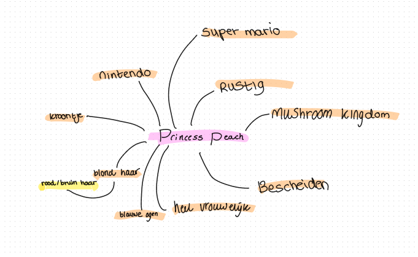
  
  
  

  Dit is de eerste versie van me schets die ik heb uitgekozen. Het idee is dat ik de nieuwste versie van Peach wil maken in de nieuwe wereld maar alle andere Peaches zijn kwijt. Het is de bedoeling dat ze hen gaat zoeken. De eerdere versie Peaches zitten vast in de kelder van de oude versie van Mario. Je ziet dus zowel tussen de twee levels dus een groot visueel verschil maar ook tussen de peach karakters.

  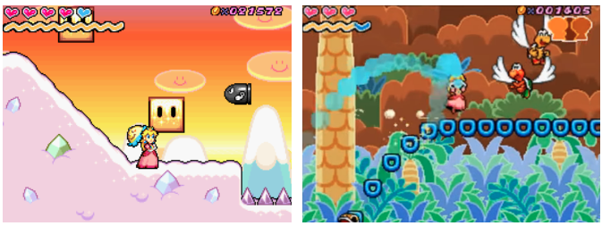

  Ik wil alles doen met een beetje princess Peach stijl. Er zijn een paar levels van haar die erg roze en meisjesachtig zijn. Dit is een uitgangspunt voor de vormgeving.

  ### Je ambitie: 
  Aan deze technieken/punten wil ik werken:
  - Graag zou ik me javascript skills willen verbeteren, ik heb hier simpelweg nog erg weinig mee gedaan en ik vind functies maken nog best lastig. Ik zou dit graag willen leren. Ik doe zelf regelmatig cursusjes en lees er dingen over maar ik merk dat ik het meeste leer van gewoon doen. 

  - Animeren. Hier heb ik bij webtypografie voor het eerst pas mee gewerkt en dit zou ik nog beter willen leren. Je kan zoveel met animatie, ik zou hier lekker mee willen experimenteren en mezelf uitdagen. De combinatie van animatie met javascript lijkt me ook erg leerzaam en iets wat ik wil gaan doen.

  - Visuele vormgeving is ook iets wat ik soms nog moeilijk vind. Om goed naar de details (paaseieren) te leren kijken. Vooral als het een vak is waar zowel code en vormgeving belangrijk zijn zoals bij dit vak vind ik het soms lastig om beide evenveel aandacht te geven. Hier wil ik mezelf ook in uitdagen om goed naar de details te kijken en echt me tijd in beide aspecten te stoppen.
 

## Voortgang/Feedback 1 

  
Mijn bevindingen + wijzigingen (minimaal 5)

  ### Bevinding 1 (van Keïsha):
  Je hebt nog geen progressive disclosure in je concept toegepast, denk hier over na.

  #### oplossing:
  Ik kreeg de feedback dat ik nog geen progressive disclosure had en dit klopt. Ik moest nog nadenken over hoe ik de informatie naar voren wou laten komen. Ik heb dit uiteindelijk gedaan met de kelder waar alle princessen in vastzaten. Hen moet je eerst zoeken want sommige zitten verstopt en daarna als je op ze klikt komt er een tekst bubbel met informatie en een klein verhaaltje tevoorschijn. De princessen heb ik een button gemaakt en een hover en active state gegeven zodat de gebruiker weet dat ze klikbaar zijn. Met toggle kan je de tekstbubbels ook weer uitzetten.

  
  

  ### Bevinding 2 (van Keïsha):
  Met javascript het karakter interactiever maken.

  #### oplossing:
  Bij level 1 met princes peach die springt om de munten te vangen was het in mijn schets nog niet heel interactief. Hierdoor heb ik een knop toegevoegd die zegt start game. Deze knop heeft ook een hover state met animatie, probeer hem uit zou ik zeggen. Zo lijkt het echt een beetje op een spelletje. Ik wou eigenlijk peach de muis laten volgen zodat het nog interactiever is en je echt de muntjes kan vangen maar hier had ik geen genoeg tijd voor dus heb het gelaten bij een setTimeOut waardoor de muntjes verdwijnen na een bepaald aantal seconden nadat er op de start knop wordt geklikt. Ook start dan pas de spring animatie van princes Peach.

  
  

  ### Bevinding 3 (van Keïsha):
  Je kan ook ideeën uit je vorige schetsen combineren met je eindschets zodat het completer wordt.

  #### oplossing:
  Ik wist zelf nog niet helemaal wat ik wou doen met de kelder en hoe ik dat wou vormgeven maar Keïsha kwam met het idee dat ik het ook kon combineren met me vorige schetsen. Toen kwam ik zelf met het idee dat ik ze kon verstoppen en dit heb ik gedaan met de buizen die je ziet in de mario game. Hier heb ik animaties bij gevoegt om het interactiever te maken.

  
  

  ### Bevinding 4:
  Mensen weten niet dat je naar beneden kan scrollen, dit kan interactiever en beter aangegeven worden.

  #### oplossing:
  Ik heb een pijltje toegevoegd die ook een animatie is en beweegd waardoor het opvalt. Als je hierop klikt krijg je section 2 (de kelder) te zien. Hier zat ik even mee te knoeien en de javascript functie lukte niet helemaal. Ik was er wel bijna. Uiteindelijk heeft Jeffrey me hierbij geholpen en zei dat ik een scrollIntoView moest gebruiken en dat ik dat maar net moest weten. 

  
  

  ### Bevinding 5:
  De sprong van princess Peach vloeiender en mooier maken

  #### oplossing:
  Ik wou mezelf uitdagen met animeren dus ik wou de sprong van peach van de bovenwereld wat mooier en vloeiender maken. Dit heb ik gedaan met behulp van deze site https://css-tricks.com/making-css-animations-feel-natural/. Ik vond dit een leuke oefening en de keyframe is voor mijn doen best complex geworden maar ik vond het vooral heel leuk om hiermee te experimenteren.

  

## Voortgang/Feedback 2

  
Mijn bevindingen + wijzigingen (minimaal 5)

  
  ### Bevinding 1 (van Nikki):
  Een tekst in de kelder met de instructies of een zinnetje met wat de bedoeling is, nu is dat nog niet helemaal duidelijk.

  #### oplossing:
  Dit vond ik hele waardevolle feedback want inderdaad er stond nergens aangegeven wat de bedoeling was. Dit heb ik gelijk toegepast door een zinnetje neer te zetten dat sommige princessen zich verstoppen en deze gezocht moeten worden.

  

  ### Bevinding 2:
  Meer dingen in peach stijl, zodat je weet dat het om haar gaat, dus meer roze etc.

  #### oplossing:
  Ook dit was ik het helemaal mee eens. Ik had er bewust voor gekozen om peach te gebruiken om haar leuke karakter en stijl en gek genoeg had ik alles ontworpen in mario stijl. Weinig meisjes achtige vormgeving, dus dit heb ik gelijk aangepast hierna. Ik heb de gradient op de achtergrond veranderd naar een roze/blauwe lucht. Hiervoor was die volledig blauw. Helaas ben ik hier vergeten fotos van te nemen. Ook heb ik de hover state van de kelder princessen roze gemaakt, hiervoor was die wit. Ik heb de tekstbalkjes ook roze gemaakt, hiervoor waren deze ook wit. Ik heb de verhaaltjes die in de tekstbalkjes staan ook verhaaltjes gegeven die bij hun karakters passen.

  
  

  ### Bevinding 3:
  De button van de start game animatie in een toepasselijker font.

  #### oplossing:
  Ik had een poos gezocht naar het Mario font maar die was niet gratis en niet rechtenvrij dus na nog langer zoeken  vond ik het font 'common pixel'. Deze vond ik erg passen bij de mario stijl. Het knopje is nu completer en past beter bij het concept.

  
  

  ### Bevinding 4:
  De animaties van de verstopte princessen passend maken naar hun karakter.

  #### oplossing:
  De princessen in de kelder hebben allemaal een tekst met een klein verhaaltje en informatie over hunzelf. Het leek me leuk de animaties passend bij deze karakters te doen. Dus de eerste verstopte is een beetje verlegen en mensenschuw, want zij is een van de oudste die daar vast zit. De middelste is heel enthousiast, omdat ze niet kan wachten om weg te gaan en haar nagels weer te lakken. Ik vond dit erg leuk om te doen.

  

  
  ### Bevinding 5:
  Bij de hover state van de gevangen princessen wou ik graag de cursor veranderen in het hoofd van de princes die niet vast zat, zodat het leek alsof ze echt met de andere princessen ging praten.

  #### oplossing:
  Dit was me helaas niet gelukt en had ook geen tijd meer om hier hulp om te vragen. Ik heb de code wel in comments gelaten in de code. Ik had eigenlijk hetzelfde geprobeerd als Sanne had voorgedaan op het bord: cursor:url(mini-gezicht-peach.png) 4 12, auto;. Dit werkte niet. Ik heb geprobeerd het foto bestand kleiner te maken, maar hij deed het nog steeds niet. Dus als ik meer tijd had gehad had ik dit graag willen verbeteren.

  

## Voortgang/Feedback 3

  
Mijn bevindingen + wijzigingen (minimaal 5)

  
  ### Bevinding 1 (van Sanne):
  Ik kreeg als feedback dat de bovenste level echt een mengelmoes was van verschillende stijlen en dat het meer in 1 stijl moet. 

  #### oplossing:
  Hier was ik het mee eens en zat hier zelf eigenlijk ookal mee. Dus ik heb de laatste dag de tijd genomen om dit visueel mooier te maken en echt vectors te zoeken die allemaal van de nieuwste versie van mario zijn. Vooral bij het kasteel had ik hier moeite mee, maar na lang zoeken en het heel precies uitsnijden op photoshop heb ik het kasteel uit 2022 kunnen gebruiken. Het kostte wel even maar nu heb ik ook wel wat.

  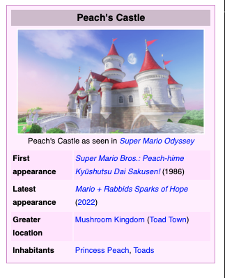

  ### Bevinding 2:
  Meer paaseieren toevoegen (in dit geval de wolken animeren en mooier maken).

  #### oplossing:
  Ik had nog wat tijd over dus koos ervoor de wolken te animeren. Bij het vorige punt had ik ze al veranderd naar actuelere mario wolken. Ik heb deze 1 op 1 niet kunnen vinden als vector dus hem ze soortvan zelf gemaakt door een andere vector te bewerken in photoshop en heb ze ook een beetje transparant gemaakt waardoor ze deels over het kasteel vallen. Ik heb ze een subtiele animatie gegeven waardoor ze langzaam omhoog en omlaag gaan. Vind dit erg leuk geworden.

  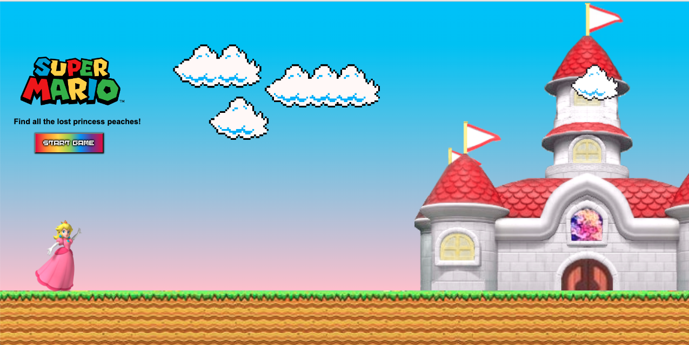
  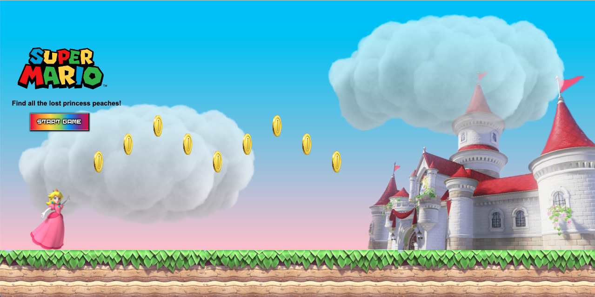

  ### Bevinding 3:
  Meer paaseieren toevoegen (in dit geval de vloer passender bij de niewste Mario vloeren).

  #### oplossing:
  Iets wat ik heel lastig vond was een actuele vloer voor section 1 vinden. Deze waren allemaal van slechte kwaliteit en met auteursrechten. Uiteindelijk kwam ik op het idee om een stukje hiervan uit te snijden en naast elkaar te plakken. Ook heb ik het wat roziger gemaakt in kleurtoon om het te laten passen bij de princess Peach stijl. Ik ben blij met het resultaat.

  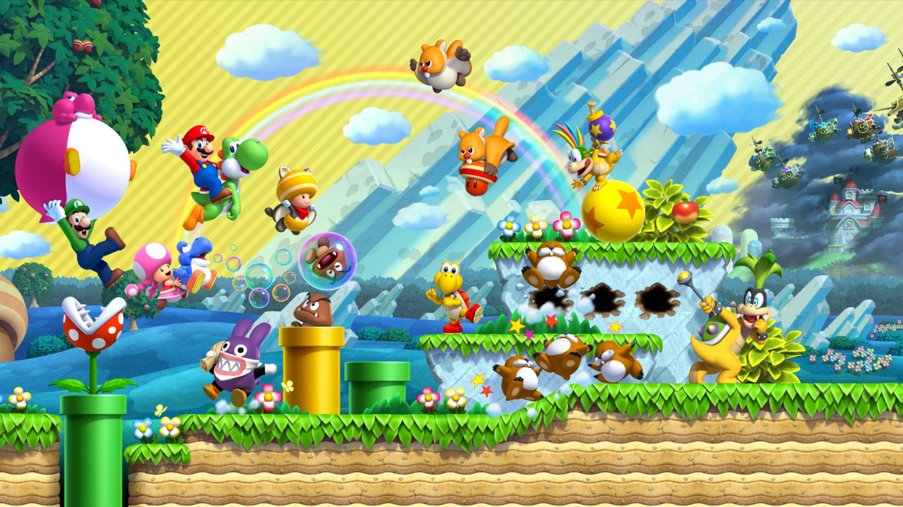
  

  ### Bevinding 4:
  Het werk responsive krijgen voor verschillende laptop schermen.

  #### oplossing:
  Een van de eisen was dat het scherm een beetje responsive moet zijn. Ik had geen flauw benul hoe ik dit voor elkaar kon krijgen zonder mediaqueries. Ik kreeg de tip van Sanne om het vw en % te werken. Dit hielp enorm en nu is het eindwerk een klein beetje responsive. Ik heb hier veel van geleerd.

  
  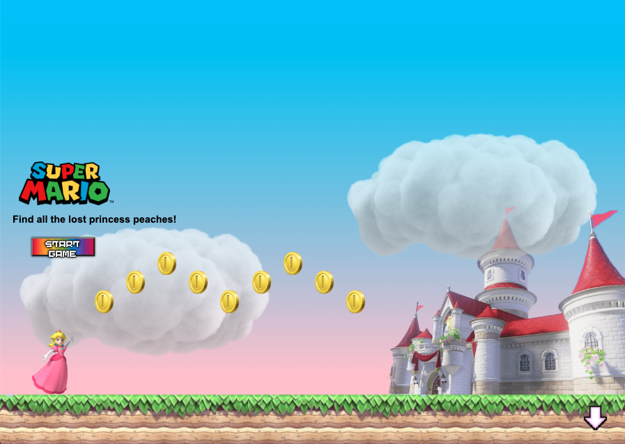

  ### Bevinding 5:
  Nog meer paaseieren toevoegen, light and dark-mode toevoegen.

  #### oplossing:
  Ik heb nog nooit iets gedaan met mediaqueries en met dark-mode. Hier wou ik mezelf in uitdagen om dit te proberen. Hierbij keek ik hoe Keïsha dit gedaan had en toen snapte ik hoe ik dit zelf ook kon toepassen. Ik liep gelukkig nergens tegenaan en vind het fijn nu ik weet hoe dit werkt. Ben ook erg blij met het resultaat. Ik heb van section 1 de achtergrond gradient aangepast en de h2 letters naar wit veranderd.

  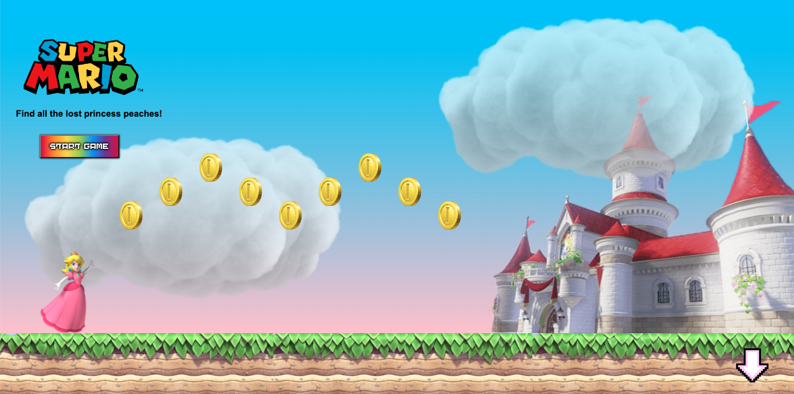
  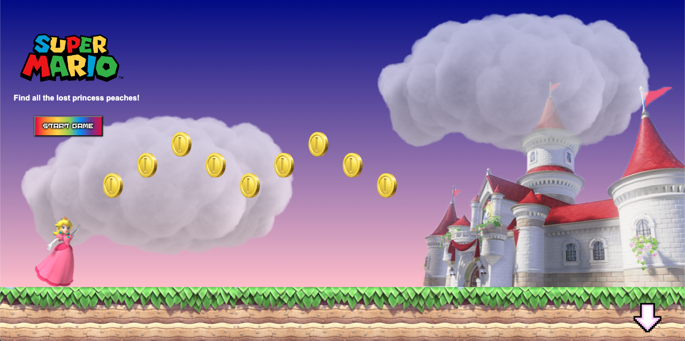

## Reflectie

  
Mijn eindresultaat & persoonlijke ontwikkeling

  ### Je uitkomst - karakteristiek screenshot(s):
  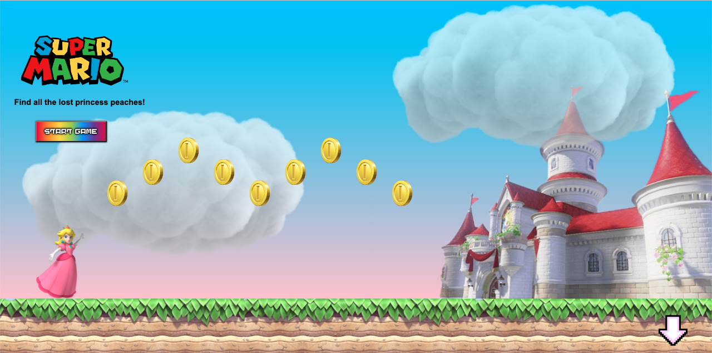
  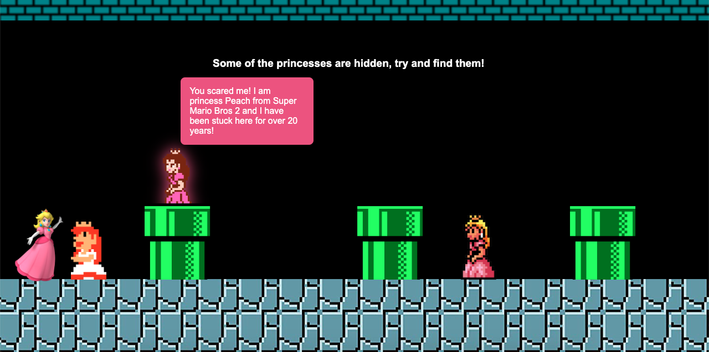

  ### Dit ging goed/Heb ik geleerd: 
  Animeren heb ik onwijs veel over geleerd en de basis van Javascript snap ik nu eindelijk, sommige javascript code is me zelfs gelukt zonder hulp en ben daar best wel trots op.

  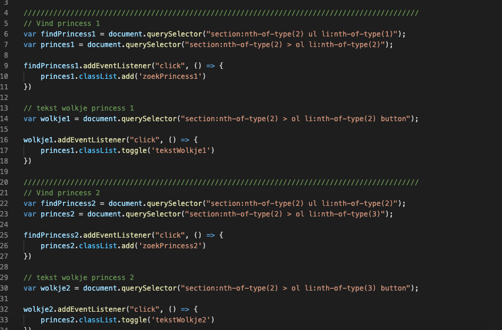

  ### Dit was lastig/Is niet gelukt:
  De cursor veranderen in het hoofd van peach is me helaas niet gelukt. Ook heb ik geen tijd gehad om het responsive te maken voor mobile version, maar had dit wel graag uit willen proberen.

  

## Bronnenlijst

continu bijhouden terwijl je werkt

1. Hulp: 
Jeffrey 
Sanne 

2. (Transparent gradient bij button) (uiteindelijk niet gebruikt in eindwerk)
https://stackoverflow.com/questions/22672368/how-to-make-a-transparent-html-button
https://www.youtube.com/watch?v=y92gnXrmmnA  

5. Codepen Sanne voor princes animaties met javascript
https://codepen.io/hilallx/pen/RwJRgQa?editors=0010 

6. Scroll into new section met button
https://stackoverflow.com/questions/8773921/how-to-automatically-scroll-down-a-html-page 
https://stackoverflow.com/questions/24836798/anchor-hash-to-the-bottom-of-the-page 
https://stackoverflow.com/questions/12102118/scrollintoview-animation (langzaam laten gaan)

7. Princess jump animatie om hem mooier te maken
https://css-tricks.com/making-css-animations-feel-natural/ 

Afbeeldingen:
1. Wolken
https://pngimg.com/image/4334

2. Ster:
https://www.pngkey.com/download/u2q8t4u2o0q8y3r5_mario-star-png-transparent-image-mario-power-ups/ 

3. Coins:
https://www.nicepng.com/ourpic/u2q8i1r5t4e6i1r5_super-mario-coins-png-jpg-black-and-white/ 

4. Peaches:
https://www.pngegg.com/en/png-bbwlr 
https://www.pngitem.com/middle/iRhwoii_princess-peach-8-bit-hd-png-download/ 
https://www.pngitem.com/middle/hTmRhTw_pink-princess-peach-princesspeach-kawaii-mario-princess-peach/ 
https://pbs.twimg.com/media/EoLz36-WMAI0PDu?format=png&name=360x360 
https://www.pngfind.com/mpng/bxThhx_princess-peach-clipart-original-design-princesa-de-mario/ 

5. Kasteel:
https://www.mariowiki.com/Peach%27s_Castle#/media/File:Peach's_Castle_side_view.png

6. Peach gezicht:
https://nl.pinterest.com/pin/177118197833559692/ 

7. vloer + plafond:
https://www.researchgate.net/profile/Michael-Green-45/publication/326476609/figure/fig3/AS:649945438773256@1531970476506/The-first-two-levels-from-Super-Mario-Bros-The-levels-show-the-difference-between.png

8. Buizen:
https://www.nicepng.com/ourpic/u2q8r5u2y3q8u2w7_mario-tube-png-8-bit-mario-pipe/ 

9. Logo:
https://commons.wikimedia.org/wiki/File:Mario_Series_Logo.svg 

10. Arrow:
http://pixelartmaker.com/art/6d3068335985a26 

